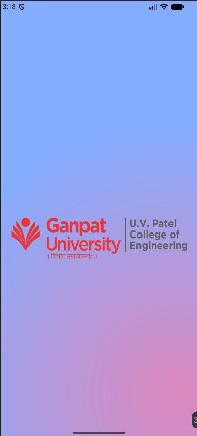
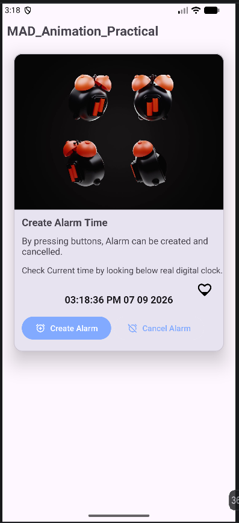

# Practical-6: Frame-by-Frame Animation & Twin Animation Splash Screen

**Student Name:** Prince Patel  
**Student Enrollment Number:** 24012011120  
**Course:** Mobile Application Development (2CEIT5PE18)  
**IDE:** Android Studio  

---

## Aim
Create an Android Application to demonstrate **Frame-by-Frame Animation** and **Splash Screen** to demonstrate **Twin Animation**.

## Overview
In this practical, an Android application is created with an animated splash screen and animated UI elements. The application demonstrates frame-by-frame animation using a sequence of images and twin animation using different animation effects.

## Concepts Studied
- ImageView
- Frame-by-Frame Animation (AnimationDrawable)
- Twin Animation (AnimationUtils, loadAnimation())
- Splash Screen (SplashActivity to MainActivity)
- Radial Gradient Background (<shape>, <gradient>)
- Edge-to-Edge Display / Immersive UI

## Practical Requirements
1. Create MainActivity with frame-by-frame animated alarm and heart elements.
2. Create SplashActivity with university logo and twin animation.
3. Configure radial gradient background (Pink to Blue).
4. Implement <set>, <scale>, <translate>, <rotate>, and <alpha> in 	winanimation.xml.

---

## Output Screenshots

### 1. Splash Screen (Twin Animation & Radial Gradient)

### 2. Main Activity (Frame-by-Frame Animation)

---

## Conclusion
The application successfully demonstrates Frame-by-Frame Animation and Twin Animation with an animated splash screen and custom UI in Android.
